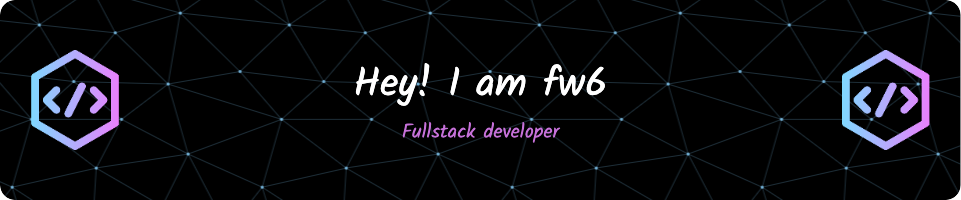

## Hey 👋, fw6 here! 


An unknown Front-end Engineer.

-   :hammer_and_pick: TypeScript / Vue / Svelte / Rust
-   :man: Pronouns: he/him


[](https://github.com/piyushsuthar/github-readme-quotes)


---

### 🎧 Spotify Playing

<!--  -->


### :bar_chart: Monthly coding time 

<!--START_SECTION:waka-->

```txt
From: 28 April 2021 - To: 17 December 2023

Total Time: 4,055 hrs 42 mins

TypeScript        1,161 hrs 40 mins███████░░░░░░░░░░░░░░░░░░   28.64 %
Vue.js            1,148 hrs 44 mins███████░░░░░░░░░░░░░░░░░░   28.32 %
JavaScript        515 hrs 24 mins ███▒░░░░░░░░░░░░░░░░░░░░░   12.71 %
Svelte            365 hrs 25 mins ██▒░░░░░░░░░░░░░░░░░░░░░░   09.01 %
JSON              296 hrs 50 mins █▓░░░░░░░░░░░░░░░░░░░░░░░   07.32 %
```

<!--END_SECTION:waka-->


